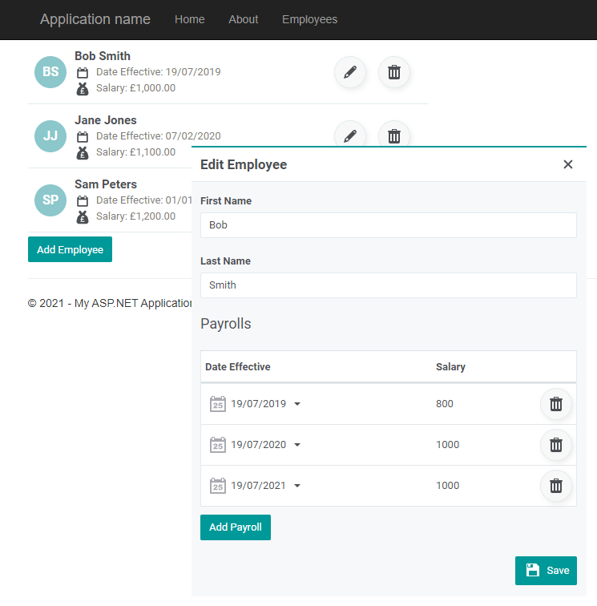

# Exercise

The theme of this exercise is around a multi-tenanted product that manages a list of employees and their salaries. 

Each customer is modeled as a company with a list of employees. Each employee may have no, one or more updates to their salary, stored as employee payroll entries.

The end result of the mini project should look similar to:

The attached solution contains 3 projects:
1. API - An ASP .NET Core project exposing a controller to perform basic CRUD operations over a list of employees. Some operations are already implemented in the project that will need to be corrected and extended.
2. Database - A SQL Database project that can be used to design, create, and update the SQL tables, views, stored procedures, etc. It also contains a post-deployment script to seed the DB with some data to work agains.
3. WebApplication - A WebForms project to build a simple screen that will consume the API
